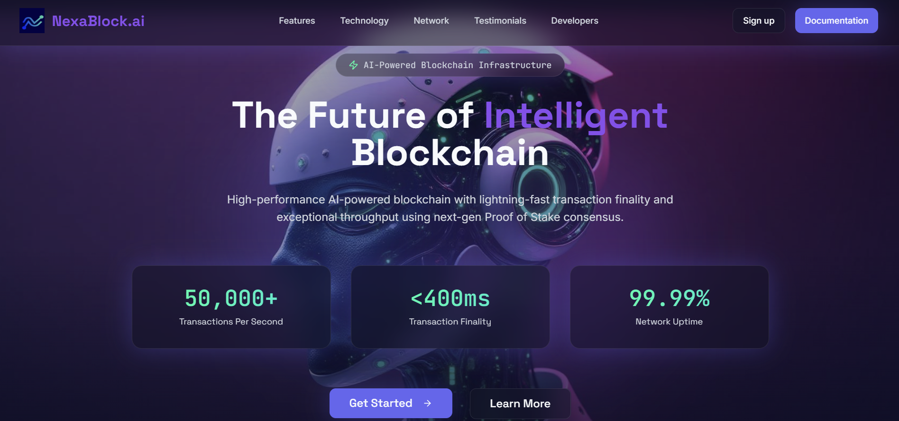

## NexaBlock.ai — AI + Blockchain Landing Page
<strong>NexaBlock.ai</strong> is a stunning and immersive landing page for a conceptual AI-driven blockchain platform. This project is more than just a website; it's a portfolio centerpiece designed to showcase the art of modern frontend development. It masterfully blends a sleek **glassmorphism** aesthetic with fluid, professional-grade animations and a simulated real-time data dashboard. The result is a compelling narrative and an engaging user experience, demonstrating how futuristic technologies can be presented in a beautiful and intuitive way.

---
### 🔗 Live Demo: [View Here](https://ai-landing-page-two-pi.vercel.app)
---

### 📖 Table of Contents

- [📍 About The Project](#-about-the-project)
- [✨ Key Features](#-key-features)
- [📌 Project Purpose](#-project-purpose)
- [💼 Built With](#️-built-with)
- [🚀 Getting Started](#-getting-started)
  - [Prerequisites](#prerequisites)
  - [Installation](#installation)
- [🎨 Design System](#-design-system)
  - [Color Palette](#color-palette)
  - [Typography](#typography)
- [📜 Available Scripts](#-available-scripts)
- [🚢 Deployment](#-deployment)

---

### 📍 About The Project

NexaBlock.ai is a conceptual next-generation blockchain platform that integrates Artificial Intelligence to optimize performance, security, and efficiency. This landing page was built to be the primary marketing and informational entry point for the platform.

The goal was to create a visually striking and immersive experience that not only looks modern but also feels alive and interactive. This is achieved through a combination of a "glassmorphism" design, subtle 3D animations, and a simulated real-time dashboard that showcases the platform's theoretical capabilities.

---

### ✨ Key Features

-   **Interactive Real-Time Dashboard:** A core feature of the page is a dashboard that simulates live blockchain statistics. It uses React's `useState` and `useEffect` hooks to periodically update metrics like Transactions Per Second (TPS), Transaction Finality, Block Height, and the number of Active Validators, giving the impression of a live, active network.

-   **Fully Responsive & Mobile-First Design:** Built using Tailwind CSS, the layout and all components are fully responsive, ensuring a seamless and intuitive experience across all devices, from large desktop monitors to small mobile screens.

-   **3D Animated Backgrounds:** Subtle, non-intrusive 3D animations created with `GSAP` are used in the background to add depth and a futuristic feel to the user interface without compromising performance.

-   **Modern "Glassmorphism" UI/UX:** The design is centered around a "glassmorphism" aesthetic, utilizing frosted glass effects, vibrant gradients, and glow effects to create a clean, high-tech look and feel.

-   **Component-Based Architecture:** The entire application is built using a modular, component-based architecture in React. Each section of the page is a distinct, reusable component, leading to a codebase that is clean, organized, and easy to maintain or scale.

-   **Developer-Friendly Tooling:** The project is set up with Vite for a lightning-fast development server and build process. TypeScript is used throughout to ensure type safety and improve the developer experience.

---
### 📸 Screenshots
### 🏠 Landing Page
  
---

### 📌 Project Purpose

The NexaBlock.ai landing page is more than a UI mockup.
It serves as:

- A design case study in futuristic blockchain branding.
- A technical demo for React, TypeScript, Tailwind, and 3D integration.
- A template that can be adapted into real-world blockchain or AI SaaS projects.

By combining AI concepts with blockchain visuals, it aims to inspire developers, product teams and designers working on next-gen web platforms.

---

### 💼 Built With

This project leverages a curated stack of modern frontend technologies and libraries.

### Core Stack:
| Technology | Description |
| :--- | :--- |
| **[React 18](https://reactjs.org/)** | A JavaScript library for building user interfaces. |
| **[TypeScript](https://www.typescriptlang.org/)** | A typed superset of JavaScript that compiles to plain JavaScript. |
| **[Vite](https://vitejs.dev/)** | A next-generation frontend tooling that provides a faster and leaner development experience. |
| **[Tailwind CSS](https://tailwindcss.com/)** | A utility-first CSS framework for rapid UI development. |

### UI & Graphics:
| Technology | Description |
| :--- | :--- |
| **[shadcn/ui](https://ui.shadcn.com/)** | Re-usable components built using Radix UI and Tailwind CSS. |
| **[Radix UI](https://www.radix-ui.com/)** | A set of low-level, unstyled, accessible UI primitives. |
| **[Lucide React](https://lucide.dev/)** | A simply beautiful and consistent icon toolkit. |
| **[GSAP](https://gsap.com/)** | A professional-grade JavaScript animation library for the modern web. |


---

### 🚀 Getting Started

Follow these instructions to set up the project locally for development and testing.

### Installation

1.  **Clone the GitHub Repository:**
    ```sh
    git clone https://github.com/your-username/NexaBlock-ai.git
    ```

2.  **Navigate to the Project Directory:**
    ```sh
    cd NexaBlock-ai
    ```

3.  **Install Project Dependencies:**
    ```sh
    npm install
    ```

4.  **Run the Development Server:**
    ```sh
    npm run dev
    ```

Once completed, the application will be running in development mode. Open your browser and navigate to `http://localhost:5173` (or the port specified in your terminal) to view the project.

---

### 🎨 Design System

The project uses a consistent design system defined in `tailwind.config.ts` and `src/index.css`.

### Typography

-   **Headings:** `Space Grotesk`
-   **Body Text:** `Inter`
-   **Code/Mono:** `JetBrains Mono`

### 📜 Available Scripts

In the project directory, you can run the following commands:

-   `npm run dev`
    -   Starts the development server using Vite with Hot Module Replacement (HMR) enabled.

-   `npm run build`
    -   Bundles the app for production to the `dist` folder. It correctly bundles React in production mode and optimizes the build for the best performance.

-   `npm run lint`
    -   Runs the ESLint linter to find and fix problems in your JavaScript code.

-   `npm run preview`
    -   Serves the production build from the `dist` directory locally to preview the final application.

---

### 🚢 Deployment

To deploy this project, you first need to create a production build:

```sh
npm run build
```

This command generates a `dist/` directory with all the static assets required to run the application. The contents of this `dist` folder can be uploaded to any static web hosting service, such as:

-   [Vercel](https://vercel.com/)
-   [Netlify](https://www.netlify.com/)
-   [GitHub Pages](https://pages.github.com/)

